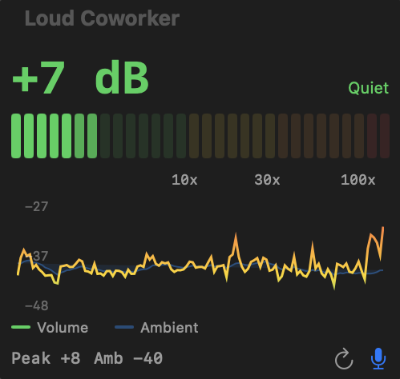
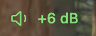

# Loud Coworker

Do you have a coworker that's too loud? Send them this.

A native macOS menu bar app that passively monitors how loud you're speaking. It sits in your menu bar, shows your real-time dB level, and color-codes it so you know when to bring it down a notch.




- **Green** — you're fine
- **Yellow** — getting there
- **Orange** — people can hear you
- **Red** — you're *that* coworker

Click the menu bar icon to toggle a floating panel with a volume meter, history chart, and ambient baseline tracking.

## Install

Requires macOS 14+ and Xcode Command Line Tools.

```
git clone https://github.com/Abhijay/loud-coworker.git
cd loud-coworker
make run
```

Grant microphone access when prompted.
